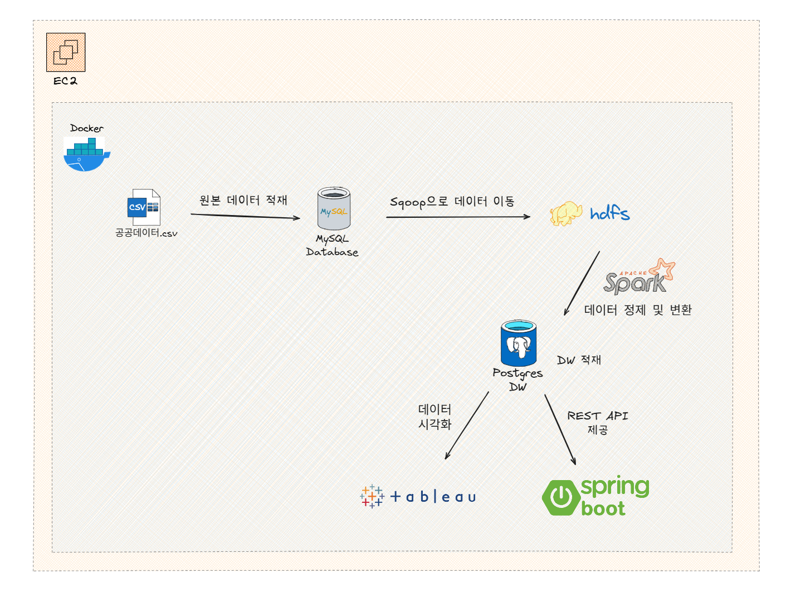

# 🔋 EVDataPipeline: 서울시 전기차 충전소 데이터 파이프라인 구축 및 시각화 (미니 프로젝트)
  
서울시 전기차 충전소 데이터를 수집 및 처리해 PostgreSQL DW에 저장하고,
DW 데이터를 REST API와 Tableau를 통해 제공하는 미니 프로젝트입니다.

## 프로젝트 개요
- 진행 기간: 2025.10.30 ~ 2025.11.07
- 프로젝트 형태: 개인 미니 프로젝트
- 목표
  - Spark & Sqoop 기반 ETL 파이프라인 구축
  - Star Schema 기반 DW 설계 및 REST API 제공
  - Tableau 대시보드를 통한 시각화 및 데이터 활용
 
## 기술 스택

| 구분        | 기술                      |
| --------- | ----------------------- |
| 데이터 소스    | 서울시 전기차 충전소 공공데이터 (CSV) |
| 데이터 적재    | MySQL → HDFS (Sqoop)    |
| 데이터 정제 및 변환 | PySpark                 |
| 데이터 저장소   | PostgreSQL (DW)         |
| 데이터 제공    | Spring Boot REST API    |
| 시각화       | Tableau                 |
| 환경 구성     | Docker, AWS EC2         |

## 시스템 아키텍처 
- MySQL → HDFS → Spark → PostgreSQL → REST API / Tableau 

## 주요 성과 
- 수집부터 시각화까지 **데이터 흐름 전체 설계 및 구현**
- Pandas EDA로 **데이터 품질 검증** 및 PySpark로 데이터 정제 및 변환 수행 
- Star Schema 기반 **DW 설계 및 REST API 개발**

